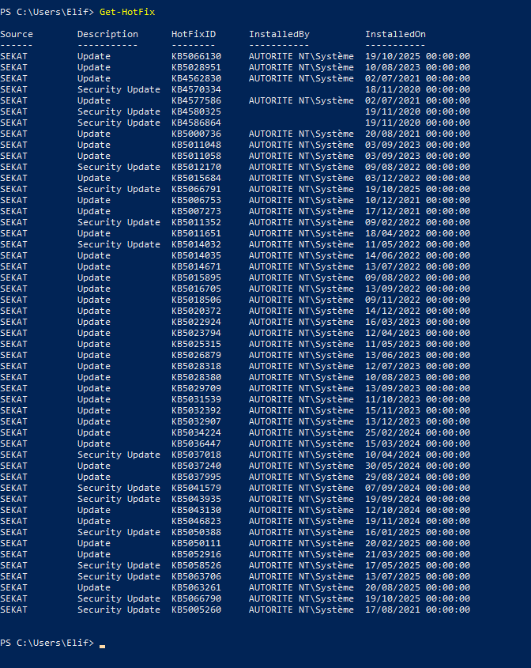
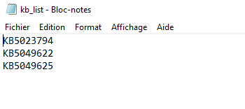
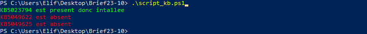
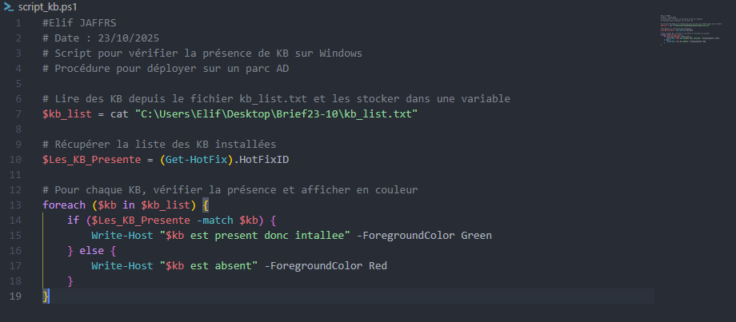
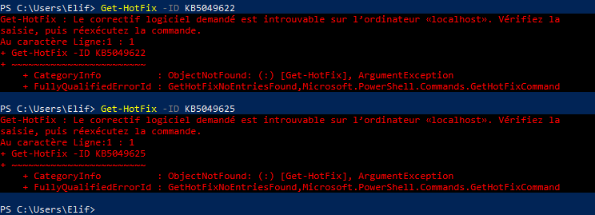
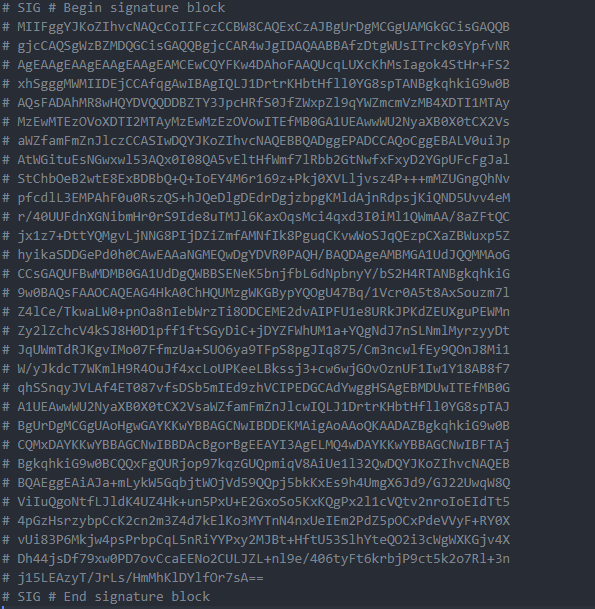
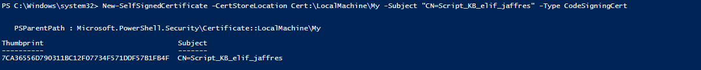
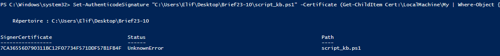
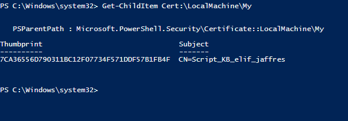
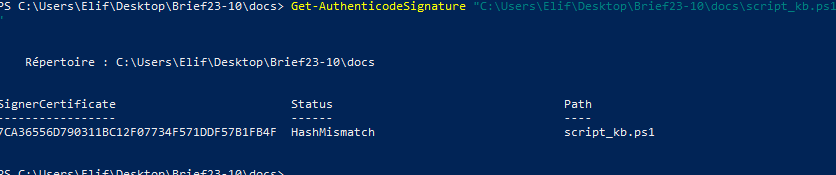

# Analyse des mises à jour Windows avec PowerShell

## Auteur
Elif JAFFRES

---

## Objectif du projet

Créer un script PowerShell qui :
- Vérifie la présence de certaines mises à jour (KB) sur Windows.
- Affiche en vert les KB présentes, en rouge les absentes.
- Lit la liste des KB à vérifier depuis un fichier texte.
- Signer-certificate.
- Peut être utilise en AD.

---

## Structure du dépôt

- `docs/script_kb.ps1` : Script PowerShell
- `docs/kb_list.txt` : Liste KBs 
- `docs/images/` : Les captures d'écran

---

## 1. Liste des KB à vérifier

Fichier : `docs/kb_list.txt`
```
KB5023794
KB5049622
KB5049625
```

---

## 2. Script PowerShell

Fichier : `docs/script_kb.ps1`

Fonctionnalités :
- Lit la liste des KB depuis `kb_list.txt`
- Récupère les KB installées avec `Get-HotFix`
- Affiche le résultat en couleur
- Est signé avec un certificat autosigné

```powershell
$kb_list = cat "C:\Users\Elif\Desktop\Brief23-10\docs\kb_list.txt"
$Les_KB_Presente = (Get-HotFix).HotFixID

foreach ($kb in $kb_list) {
    if ($Les_KB_Presente -match $kb) {
        Write-Host "$kb est present donc installee" -ForegroundColor Green
    } else {
        Write-Host "$kb est absent" -ForegroundColor Red
    }
}
```

---

## 3. Explication des commandes

- `cat` : Alias de `Get-Content`, lit chaque ligne du fichier texte.
- `Get-HotFix` : Liste toutes les mises à jour installées sur le système.
- Boucle `foreach` : Parcourt chaque KB à vérifier et affiche le résultat en couleur.
- Signature : Le script est signé avec un certificat autosigné pour garantir son intégrité.

---

## 4. Signature du script

Pour signer le script :
```powershell
New-SelfSignedCertificate -CertStoreLocation Cert:\LocalMachine\My -Subject "CN=Script_KB_elif_jaffres" -Type CodeSigningCert
$cert = Get-ChildItem Cert:\LocalMachine\My | Where-Object { $_.Subject -eq "CN=Script_KB_elif_jaffres" }
Set-AuthenticodeSignature "C:\Users\Elif\Desktop\Brief23-10\docs\script_kb.ps1" -Certificate $cert
Get-AuthenticodeSignature "C:\Users\Elif\Desktop\Brief23-10\docs\script_kb.ps1" #Verif signature
```

---

## 5. Captures d'écran


### a. Liste de toutes les KB installées


### b. Contenu du fichier kb_list.txt


### c. Exécution du script et résultat


### d. Exemple de script affiché


### e. Exemple de KB absentes


### f. Signature du script


### g. Création du certificat (étapes)





### h. Verification du certificat -signature

